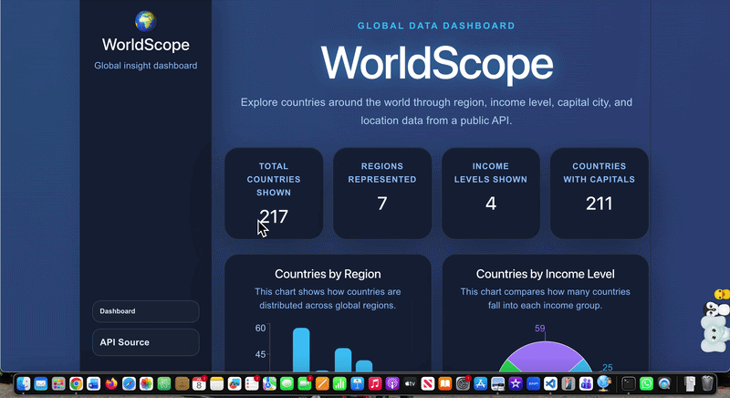

# Web Development Project 6 - *WorldScope Dashboard: Part 2*

Submitted by: **Janavi Bhalala**

This web app: **WorldScope is an interactive global data dashboard built with React. It fetches country data from a public API and displays summary statistics, searchable and filterable country data, clickable detail views, and charts that help users understand global region and income-level patterns.**

Time spent: **3** hours spent in total

## Required Features

The following **required** functionality is completed:

* [x] **Clicking on an item in the list view displays more details about it**

  * [x] Clicking on an item in the dashboard list navigates to the detail view for that item
  * [x] Detail view includes extra information not included in the dashboard view
  * [x] The same sidebar is displayed in detail view as in dashboard view

* [x] **Each detail view of an item has a direct, unique link to that item’s page**

  * [x] Each country detail page has a unique URL using the country code
  * [x] The URL changes when a user opens a country detail view

* [x] **The app includes at least two unique charts developed using the fetched data that tell an interesting story**

  * [x] At least two charts are incorporated into the dashboard view of the site
  * [x] Each chart describes a different aspect of the dataset
  * [x] A bar chart shows the number of countries by region
  * [x] A pie chart shows the number of countries by income level

## Stretch Features

The following **optional** features are implemented:

* [x] The site’s customized dashboard contains more content that explains what is interesting about the data

  * [x] Each chart includes a short description explaining what the visualization represents
  * [x] The dashboard includes summary statistics that update based on the filtered data

* [ ] The site allows users to toggle between different data visualizations

## Additional Features

The following **additional** features are implemented:

* [x] Added a persistent sidebar that appears on both the dashboard and detail views
* [x] Added clickable country rows that open a detailed country page
* [x] Added a direct link display for each country detail view
* [x] Added a polished dark glassmorphism dashboard UI
* [x] Added two Recharts visualizations using fetched API data
* [x] Kept the original search and region filter functionality from Part 1
* [x] Maintained summary statistic cards on the dashboard

## Video Walkthrough

Here's a walkthrough of implemented required features:



GIF created with **Kap / ezgif**.

## Notes

One challenge I encountered was adding detail views without creating a separate routing setup. I solved this by using the browser hash in the URL so each country has a direct and unique link, such as `#/country/IND`.

Another challenge was creating charts that told different stories about the same dataset. I used a bar chart to show how countries are distributed by region and a pie chart to show how countries are grouped by income level.

## License

```
Copyright 2026 Janavi Bhalala

Licensed under the Apache License, Version 2.0 (the "License");
you may not use this file except in compliance with the License.
You may obtain a copy of the License at

    http://www.apache.org/licenses/LICENSE-2.0

Unless required by applicable law or agreed to in writing, software
distributed under the License is distributed on an "AS IS" BASIS,
WITHOUT WARRANTIES OR CONDITIONS OF ANY KIND, either express or implied.
See the License for the specific language governing permissions and
limitations under the License.
```
